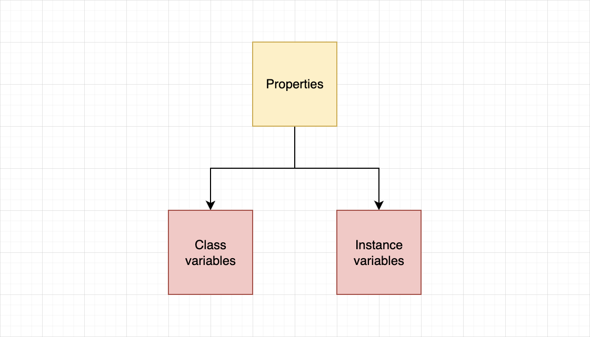
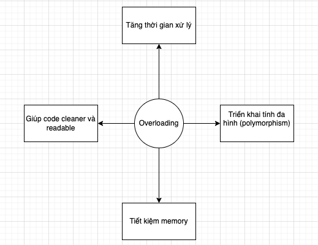
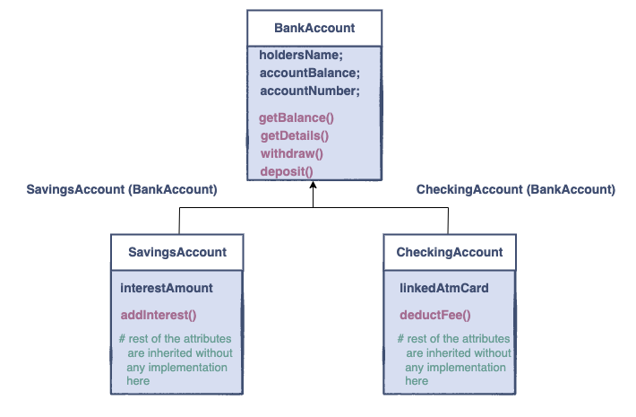
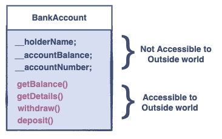

# Introduction to Objects and Classes
## Objects, classes, properties và methods
Khi đi làm, mỗi người trong công ty đều có tên định danh (ID), mức lương (salary) và phòng ban (department) khác nhau nhưng họ đều là nhân viên (employee). 

Vậy để dễ quản lý, chúng ta coi employee là 1 **class** - tập hợp các employee có đặc điểm chung về **properties** (đều có ID, salary, department) nhưng khác giá trị. Ví dụ employee A, employee B là **objects** thuộc **class** employee.

**Method** giống như một function có thể truy cập vào properties của 1 class. Methods có thể nhận và trả về giá trị, thực hiện các hành động nào đó trên một đối tượng của một class.

Ví dụ Employee object sẽ có methods như tính thuế thu nhập dựa trên lương (`tax()`), hay cung cấp thông tin của employee (`employee_info()`).

### Ví dụ về tạo một class và tạo object của class đó
```Python
class MyClass:
    info = "This is my first Class in Python"

obj = MyClass() # creating a MyClass Object

print(obj.info)  # print value of info variable of obj
```
**Output**
```
This is my first Class in Python
```
Ở trên, chúng ta đã tạo class `MyClass` và tạo một object `obj` thuộc class `MyClass`. Sau đó chúng ta in ra giá trị của `info` variable của object `obj`. Chúng ta có thể truy cập property của object bằng cách dùng (`.`).

# Initializing Objects
Initializer được dùng để khởi tạo một object của một class. Initializer được gọi tự động khi một object của class được tạo. Đây là một method đặc biệt giúp chúng ta xác định và gán giá trị cho các variables của instance.

Dưới đây là ví dụ khi object của `Employee` class được tạo.
```Python
class Employee:
    # defining the properties and assigning None to them
    def __init__(self, ID = None, salary = 0, department = None):
        self.ID = ID
        self.salary = salary
        self.department = department

# creating an object of the Employee class with default parameters
Steve = Employee()
# creating an object of the Employee class with our parameters
Mark = Employee("3789", 2500, "Human Resources")

# Printing properties of Steve and Mark
print("Steve")
print("ID :", Steve.ID)
print("Salary :", Steve.salary)
print("Department :", Steve.department)
print("Mark")
print("ID :", Mark.ID)
print("Salary :", Mark.salary)
print("Department :", Mark.department)
```

**Output**
```
Steve
ID : None
Salary : 0
Department : None
Mark
ID : 3789
Salary : 2500
Department : Human Resources
```
# Class và Instance Variables
Trong Python, properties được chia làm 2 loại:
- Class variables
- Instance variables



## Class variables
Tất cả các objects của class đều được phép truy cập và thay đổi giá trị của **class variable**. Khi thay đổi giá trị của **class variable** thì giá trị của property này sẽ thay đổi trong tất cả các object của class.

## Instance variables
**Instance variables** là của riêng với mỗi objects. Sự thay đổi ở instance variables của object nào thì chỉ ảnh hưởng đến object đó.

## Khai báo class variable và instance variable
**Class variables** được khai báo ngoài `initializer` và **instance variables** được khai báo trong scope của `initializer`

```python
class Player:
    teamName = 'Manchester City'  # class variables

    def __init__(self, name):
        self.name = name  # creating instance variables
```

## Ví dụ về sử dụng class variable `sai`
Chúng ta phải sử dụng **class variable** đúng cách vì như đã nói, chúng được chia sẻ cho tất cả các objects thuộc class và có thể thay đổi giá trị của **class variable** bằng cách sử dụng bất kỳ objects nào.

```python
class Player:
    teamName = 'Manchester City'  # class variables
    formerTeams = [] # class variables
    def __init__(self, name):
        self.name = name  # creating instance variables

p1 = Player("David Silva")
p2 = Player("Yaya Toure")

p1.formerTeams.append('Celta Vigo') # wrong use of class variable
p2.formerTeams.append('Barcelona') # wrong use of class variable

print("Name:", p1.name)
print("Team Name:", p1.teamName)
print(p1.formerTeams)
print("Name:", p2.name)
print("Team Name:", p2.teamName)
print(p2.formerTeams)
```
**Output**
```
Name: David Silva
Team Name: Manchester City
['Celta Vigo', 'Barcelona']
Name: Yaya Toure
Team Name: Manchester City
['Celta Vigo', 'Barcelona']
```

Ở ví dụ trên, trong khi **instance variable** `name` là riêng biệt cho mỗi object thuộc `Player` class. Thì **class variable** `formerTeams`, có thể truy cập bởi tất cả các object thuộc class nên nó đã được cập nhật giá trị. 

Chúng ta đang lưu trữ tất cả các cầu thủ hiện đang chơi cho cùng một đội, nhưng mỗi cầu thủ trong đội phần lớn sẽ không cùng đội bóng cũ. Để tránh vấn đề này, triển khai chính xác cho ví dụ trên sẽ như sau:

```python
class Player:
    teamName = 'Manchester City'  # class variables
    
    def __init__(self, name):
        self.name = name  # instance variables
        self.formerTeams = [] # instance variables

p1 = Player("David Silva")
p2 = Player("Yaya Toure")

p1.formerTeams.append('Celta Vigo') # wrong use of class variable
p2.formerTeams.append('Barcelona') # wrong use of class variable

print("Name:", p1.name)
print("Team Name:", p1.teamName)
print(p1.formerTeams)
print("Name:", p2.name)
print("Team Name:", p2.teamName)
print(p2.formerTeams)
```
**Output**
```
Name: David Silva
Team Name: Manchester City
['Celta Vigo']
Name: Yaya Toure
Team Name: Manchester City
['Barcelona']
```
Bây giờ, `formerTeams` đã là của riêng của mỗi `Player` object, và sẽ được truy cập bởi object đó mà thôi.

## Một ví dụ khác về sử dụng class variables
```python
class Player:
    teamName = 'Manchester City'      # class variables
    teamMembers = []

    def __init__(self, name):
        self.name = name        # creating instance variables
        self.formerTeams = []
        self.teamMembers.append(self.name)


p1 = Player('David Silva')
p2 = Player('Yaya Toure')

print("Team Name:", p1.teamName)
print("Team Members:")
print(p1.teamMembers)
print("")
print("Name:", p2.name)
print("Team Members:")
print(p2.teamMembers)
```

**Output**
```
Team Name: Manchester City
Team Members:
['David Silva', 'Yaya Toure']

Name: Yaya Toure
Team Members:
['David Silva', 'Yaya Toure']
```
Ở ví dụ trên, chúng ta đã khai báo `teamMembers`, một list được chia sẻ với tất cả các object thuộc `Player` class. Mỗi object `Player` được tạo ra, `name` của object sẽ được thêm vào list `teamMembers`, chúng ta có thể thấy `p1` và `p2` đều có thể truy cập vào `teamMembers`.

# Methods trong một Class
Trong phần này, chúng ta sẽ xem về chuyện tương tác giữa ``properties`` và các ``objects``. Đây là lúc ``methods`` xuất hiện, có 3 loại `method` trong Python:
1. **instance methods**
2. **class methods**
3. **static methods**

> `Note`: Chúng ta sẽ gọi **method** cho **instance method** vì nó thường được sử dụng nhất.

## Instance Method

> **`Methods`** là một nhóm các statements (câu lệnh) thực hiện một số thao tác (operations) và có thể trả về (return) hoặc không trả về một kết quả.

### self
Chúng ta có một class `Employee`
```python
class Employee:
    def __init__(self, ID=None, department=None):
        self.ID = ID
        self.department = department
```
Khi chúng ta tạo object employee1
```python
employee1 = Employee("Puraudorin", "FAA")
```
Thì Python sẽ convert giúp chúng ta thành:
```Python
Employee.__init__(employee1, "Puraudorin", "FAA")
```
Và bên trong ``initializer`` sẽ thực thi như sau:
```
employee1.ID = "Puraudorin"
employee1.department = "FAA"
```


## Method overloading
> Overloading đề cập đến việc làm cho một method thực hiện các operations khác nhau dựa trên các **arguments** của nó.


> Không như các ngôn ngữ lập trình khác, methods **không thể** explicitly overloaded (nạp chồng rõ ràng) ở Python, chỉ có thể implicitly overloaded (nạp chồng ngầm). (Như ở `Java` thì có thể tạo nhiều constructor trong class với số lượng parameters khác nhau để khi tạo object tùy số lượng parameters truyền vào thì Class sẽ biết mà sử dụng constructor nào.)




### Ví dụ
```python
class Employee:
    # defining the properties and assigning them None to the
    def __init__(self, ID=None, salary=None, department=None):
        self.ID = ID
        self.salary = salary
        self.department = department

    # method overloading
    def demo(self, a, b, c, d=5, e=None):
        print("a =", a)
        print("b =", b)
        print("c =", c)
        print("d =", d)
        print("e =", e)
    def demo(self, a, b, c):
        print("a = ", a)
        print("b = ", b)
        print("c = ", c)
        

# cerating an object of the Employee class
Steve = Employee()

# Printing properties of Steve
print("Demo 1")
Steve.demo(1, 2, 3)
print("\n")

print("Demo 2")
Steve.demo(1, 2, 3, 4, 5)

```

**Output**
```
Demo 1
a =  1
b =  2
c =  3


Demo 2

Traceback (most recent call last):
  File "main.py", line 30, in <module>
    Steve.demo(1, 2, 3, 4, 5)
TypeError: demo() takes 4 positional arguments but 6 were given
```

Nhận được `TypeError`, điều này là khi có nhiều method trùng tên, Python sẽ coi method được khai báo cuối cùng là method sẽ được sử dụng khi chúng ta gọi. Ở đây là method `demo` với 4 parameters.

Vậy phải làm sao? Chúng ta có vài cách để thực hiện method overloading trong Python, ở đây chúng ta sẽ dùng **multiple dispatch**

```python
from multipledispatch import dispatch

class Employee:
    # defining the properties and assigning them None to the
    def __init__(self, ID=None, salary=None, department=None):
        self.ID = ID
        self.salary = salary
        self.department = department

    @dispatch(int, int, int, int, int)
    def demo(self, a, b, c, d=5, e=None):
        print("a =", a)
        print("b =", b)
        print("c =", c)
        print("d =", d)
        print("e =", e)
        
    @dispatch(int, int, int)
    def demo(self, a, b, c):
        print("a = ", a)
        print("b = ", b)
        print("c = ", c)
        

# cerating an object of the Employee class
Steve = Employee()

# Printing properties of Steve
print("Demo 1")
Steve.demo(1, 2, 3)
print("\n")

print("Demo 2")
Steve.demo(1, 2, 3, 4, 5)
```
**Output**
```
Demo 1
a =  1
b =  2
c =  3


Demo 2
a = 1
b = 2
c = 3
d = 4
e = 5
```

## Class Method

**Class methods** làm việc với **class variables** và có thể truy cập bằng cách sử dụng `Class name` thay vì object.

> **Class method** được truy cập bằng cách sử dụng tên Class và có thể truy cập mà không cần tạo class object.

### Syntax

Để khai báo một class method, chúng ta sử dụng `@classmethod` decorator. `cls` được sử để refer tới class cũng như chúng ta sử dụng `self` để refer tới object của class. Bạn cũng có thể sử dụng bất cứ tên nào để thay thế `cls`, nhưng vì convention (quy ước), chúng ta sẽ sử dụng `cls`.

> `Note`: Không như `instance methods` (methods), tất cả class methods phải có ít nhất 1 parameter, là `cls`.

### Ví dụ
```python
class Player:
    teamName = 'Manchester City'  # class variable

    def __init__(self, name):
        self.name = name  # instance variable

    # define getTeamName using @classmethod decorator
    @classmethod
    def getTeamName(cls):
        return cls.teamName


print(Player.getTeamName())
```
**Output**
```
Manchester City
```

> `Note`: `cls` cũng hoạt động tương tự `self` ở methods, khi chúng ta gọi class method bằng object hay class thì `class name` sẽ được ngầm gán cho parameter thứ nhất của **class method** (`cls` sẽ thay bằng `class name`)


## Static methods
Static method là method được dùng chỉ giới hạn ở phạm vi class. Chúng không tương tác với **class variable** hay **instance variable**. Chúng được sử dụng như các *utility functions* bên trong class.

> Static methods có thể được truy cập bằng cách sử dụng class name hoặc object name

### Syntax 
Để khai báo static method, chúng ta sử dụng `@staticmethod` decorator. Vì nó không được sử dụng để tham chiếu đến *object* hay *class* nên chúng ta không sử dụng `self` hay `cls` argument. 

Static methods không biết bất cứ thứ gì về state của class, ví dụ nó không thể chỉnh sửa các thuộc tính của class.
Chúng ta có thể truyền bao nhiêu tham số cũng được vào static method này để thực hiện bất kỳ hàm nào mà không can thiệp vào **instance** hoặc **class variable**. Cứ coi nó như một utility function .

### Ví dụ
```python
class Player:
    teamName = 'Manchester City'  # class variables

    def __init__(self, name):
        self.name = name  # creating instance variables

    @staticmethod
    def demo():
        print("I am a static method.")


p1 = Player('lol')
p1.demo()
Player.demo()
```
**Output**
```
I am a static method.
I am a static method.
```

Giả sử chúng ta có 1 class `BodyInfo` chứa thông tin về cân nặng và chiều cao của một người. Chúng ta có thể tạo một static method để tính BMI cho bất kỳ `cân nặng` và `chiều cao` nào được truyền vào, ví dụ:

```python
class BodyInfo:

    @staticmethod
    def bmi(weight, height):
        return weight / (height**2)

weight = 75
height = 1.8
print(BodyInfo.bmi(weight, height))
```

**Output**
```
23.148148148148145
```

Vì sự đặc biệt của static method, nó được dùng rất hạn chế, khi cần sử dụng utility function mà không cần tham chiếu tới object hay class thì chúng ta có thể tạo ra chúng, việc gọi chúng thông qua `class name` hay `class object` giúp chúng ta hiểu rõ về bối cảnh sử dụng cũng như chức năng của chúng.

# Access Modifiers
Chúng ta cùng tìm hiểu về `private`, `public` **attributes** trong Python

## Public attributes
> Public attributes có thể truy cập trong class và ngoài class.

Trong Python, tất cả *methods* và *properties* mặc định là public. Nếu chúng ta muốn chỉ định một method nào đó không nên được truy cập như là `public` method, chúng ta phải khai báo nó là `private`.
### Ví dụ về public attributes
```Python
class Employee:
    def __init__(self, ID, salary):
        # all properties are public
        self.ID = ID
        self.salary = salary

    def displayID(self):
        print("ID:", self.ID)


Steve = Employee(3789, 2500)
Steve.displayID()
print(Steve.salary)
```
**Ouput**
```
ID: 3789
2500
```
Ở phần code trên, properties `ID`, `salary` và method `displayID()` là **public** nên chúng ta có thể truy cập ở trong cũng như ở ngoài class.

## Private attributes
> Private attributes không thể truy cập trực tiếp từ ngoài class, chỉ có thể truy cập ở bên trong class.

Mục đích là để ẩn nó khỏi người dùng và các class khác. Ở Python, chúng ta có thể tạo private attribute bằng cách sử dụng tiền tố (prefix) `__` .

### Private properties
Ví dụ:
```python
class Employee:
    def __init__(self, ID, salary):
        self.ID = ID
        self.__salary = salary  # salary is a private property


Steve = Employee(3789, 2500)
print("ID:", Steve.ID)
print("Salary:", Steve.__salary)  # this will cause an error
```


**Output**
```
ID: 3789


Traceback (most recent call last):
  File "main.py", line 9, in <module>
    print("Salary:", Steve.__salary)  # this will cause an error
AttributeError: 'Employee' object has no attribute '__salary'
```
`ID` là *public* property nhưng `__salary` là *private* property nên không thể truy cập bên ngoài class.

### Private methods
```python
class Employee:
    def __init__(self, ID, salary):
        self.ID = ID
        self.__salary = salary  # salary is a private property

    def displaySalary(self):  # displaySalary is a public method
        print("Salary:", self.__salary)

    def __displayID(self):  # displayID is a private method
        print("ID:", self.ID)


Steve = Employee(3789, 2500)
Steve.displaySalary()
Steve.__displayID()  # this will generate an error
```

**Output**
```
Salary: 2500

Traceback (most recent call last):
  File "main.py", line 15, in <module>
    Steve.__displayID()  # this will generate an error
AttributeError: 'Employee' object has no attribute '__displayID'
```

Tương tự như trên, `__displayID` là *private* method, không thể truy cập được từ bên ngoài class.

> `Note`: Methods thường là public

### Truy cập private attributes trong main code
Nếu cảm thấy thật sự cần thiết truy cập *private* property hoặc method, chúng ta có thể sử dụng `_<ClassName>` prefix để truy cập, ví dụ như:
```python
class Employee:
    def __init__(self, ID, salary):
        self.ID = ID
        self.__salary = salary  # salary is a private property


Steve = Employee(3789, 2500)
print(Steve._Employee__salary)  # accessing a private property
```
**Output**
```
2500
```

# Information Hiding
**Information hiding** đề cập đến khái niệm ẩn đi các hoạt động đang diễn ra bên trong 1 class, và chỉ cung cấp 1 interface mà thông qua đó thế giới bên ngoài có thể tương tác với class mà không cần biết bên trong có gì.

Data hiding có thể chia làm 2 phần chính:
1. Encapsulation (Tính đóng gói)
2. Abstraction (Tính trừu tượng)

## Encapsulation
Có thể hiểu, tính đóng gói là việc đưa tất cả dữ liệu, methods vào bên trong object và chúng ta sẽ thao tác với dữ liệu, methods đó bên trong class. Những thứ bên trong sẽ không thể bị sửa đổi hay truy cập bởi những mã lệnh bên ngoài từ những phần khác của chương trình.

## Getter and Setters
Để có thể truy cập vào các properties từ bên ngoài class, chúng ta dùng `getter` và `setter`
- `getter` method cho phép đọc giá trị của property
- `setter` method cho phép chỉnh sửa giá trị của property
```python
class User:
    def __init__(self, username=None):  # defining initializer
        self.__username = username

    def setUsername(self, x):
        self.__username = x

    def getUsername(self):
        return (self.__username)


Steve = User('steve1')
print('Before setting:', Steve.getUsername())
Steve.setUsername('steve2')
print('After setting:', Steve.getUsername())

```
**Output**
```
Before setting: steve1
After setting: steve2
```
Ở đoạn code trên, chúng ta đã tạo một class `User`, 1 private property `username` và getter và setter method cho property đó.  Sau đó chúng ta tạo object `Steve` và gán giá trị của `username` là "steve1", sau đó in ra giá trị đó. Tiếp theo đó chúng ta sử dụng `setUsername` method để thay đổi giá trị của `username` thành "steve2" sau đó chúng ta thấy giá trị của `username` đã được sửa thành "steve2" khi in ra.
## Lợi ích của Encapsulation
- Dễ bảo trì: Mã được đóng gói trong những phần riêng biệt, như là class, method, interface, etc. Vì vậy khi thay đổi hay cập nhật thì chúng không ảnh hưởng đến phần còn lại.
- Testing khỏe hơn: Chúng ta dễ test hơn vì sẽ chỉ phải tập trung ở 1 nơi chứ không phải lo nó còn ảnh hưởng đến nơi nào khác không. Tiết kiệm thời gian.
- Che giấu dữ liệu: Khi sử dụng người dùng chỉ sẽ nhận được kết quả mà không biết hay truy cập được chi tiết bên trong của object.

# Inheritance
Inheritance giúp chúng ta tạo một class mới từ một class đã tồn tại. Vậy khi nào chúng ta có thể làm vậy? 

Bất cứ khi nào mối quan hệ giữa 2 objects là **IS A** thì chúng ta có thể. Ví dụ như `Car` **IS A** `Vehicle`, `Bicycle` **IS A** Vehicle, etc. `Vehicle` sẽ được có các properties như `make`, `color`, `model`.

 `Car` hay `Bicycle` hay `Train` đều có các properties trên, và chúng đều **IS A** `Vehicle`. 
 Giả sử phần mềm chúng ta được tạo ra để quản lý Vehicle. Chúng ta sẽ tạo ra class `Vehicle` và nó sẽ là parent class (super class), `Car` hay `Bicycle` hay `Train` sẽ là child class (sub class) và chúng sẽ thừa kế từ `Vehicle` các **non-private** *variables* và *methods*.

### Ví dụ 1
```python
class Vehicle:
    def __init__(self, make, color, model):
        self.make = make
        self.color = color
        self.model = model

    def printDetails(self):
        print("Manufacturer:", self.make)
        print("Color:", self.color)
        print("Model:", self.model)


class Car(Vehicle):
    def __init__(self, make, color, model, doors):
        # calling the constructor from parent class
        Vehicle.__init__(self, make, color, model)
        self.doors = doors

    def printCarDetails(self):
        self.printDetails()
        print("Doors:", self.doors)


obj1 = Car("Suzuki", "Grey", "2015", 4)
obj1.printCarDetails()
```
**Output**
```
Manufacturer: Suzuki
Color: Grey
Model: 2015
Doors: 4
```
Ở đoạn code trên, chúng ta tạo ra 2 class `Vehicle` - parent class và `Car(Vehicle)` - child class thừa kế từ `Vehicle`. Để ý hàm `__init__` của `Car`, chúng ta có gọi lại hàm `__init__` của `Vehicle`, hàm `printCarDetails` cũng gọi hàm `printDetails` của `Vehicle`. Như đã nói, child class sẽ thừa kế lại các non-private methods và variables từ parent class. Sau đó chúng ta tạo ra object `obj1` Car và truyền vào giá trị cho nó. Sau đó chúng ta gọi hàm `printCarDetails` và hàm nãy đã in ra toàn bộ thông tin của `obj1` mà có sử dụng hàm `printDetails` của `Vehicle`.

## `super()` function
### Truy cập vào property của parent class
### Ví dụ 2
```python
class Vehicle:  # defining the parent class
    fuelCap = 90

class Car(Vehicle):  # defining the child class
    fuelCap = 50

    def display(self):
        # accessing fuelCap from the Vehicle class using super()
        print("Fuel cap from the Vehicle Class:", super().fuelCap)

        # accessing fuelCap from the Car class using self
        print("Fuel cap from the Car Class:", self.fuelCap)


obj1 = Car()  # creating a car object
obj1.display()  # calling the Car class method display()
```
**Output**
```
Fuel cap from the Vehicle Class: 90
Fuel cap from the Car Class: 50
```
Chúng ta đã truy cập vào giá trị của property của parent class bằng cách sử dụng `super().`parent_class_property.

### Gọi method của parent class
### Ví dụ 3
```python
class Vehicle:  # defining the parent class
    def display(self):  # defining display method in the parent class
        print("I am from the Vehicle Class")


class Car(Vehicle):  # defining the child class
    # defining display method in the child class
    def display(self):
        super().display()
        print("I am from the Car Class")


obj1 = Car()  # creating a car object
obj1.display()  # calling the Car class method display()
```
**Output**
```
I am from the Vehicle Class
I am from the Car Class
```
### Sử dụng `super()` với initializer
### Ví dụ 4
```python
class ParentClass():
    def __init__(self, a, b):
        self.a = a
        self.b = b


class ChildClass(ParentClass):
    def __init__(self, a, b, c):
        super().__init__(a, b)
        self.c = c


obj = ChildClass(1, 2, 3)
print(obj.a)
print(obj.b)
print(obj.c)

```
Nếu bạn để ý qua 3 ví dụ trên, thì ở ví dụ đầu tiên chúng ta gọi `__init__` bằng tên của parent class, ở đây lại gọi bằng `super()`, đó là 2 cách chúng ta có thể.

Như đã nói, child class thừa kế tất cả methods và variables mà non-private của parent class. Chúng ta có thể dùng `self` để truy cập chúng. Và chúng ta gọi `self.printDetails` ở **ví dụ 1** thay vì `super().printDetails` là tại vì ở **ví dụ 1** chúng ta có 2 methods *khác tên* (`printCarDetails` và `printDetails`), nếu chúng ta dùng `self` mà tên 2 methods ở parent class và child class là giống nhau thì sẽ bị lỗi. 

Còn ở **ví dụ 3** chúng ta có thể đặt tên method của parent class và child class giống nhau vì chúng ta dùng `super()`, tiện thể nhắc luôn parent class còn được gọi là super class.
```python
ParentClass().__init__(a, b)
```
## Lợi ích của Inheritance
Ví dụ như sau, `BankAccount` thì sẽ có `SavingsAccount` và `CheckingAccount`,


### Reusability (Tái sử dụng)
Trong ví dụ trên chúng ta không cần viết lại code cho `deposit()` và `withdraw()` methods bên trong 2 child classes `SavingsAccount` và `CheckingAccount`.
### Code modification (Dễ bảo trì/ sửa đổi)
Giả sử bạn đặt cùng một đoạn code vào các class khác nhau, khi chúng ta muốn sửa đổi đoạn code đó, và nó ở trong rất nhiều class, sẽ có khả năng chúng ta quên sửa ở 1 class nào đó và sẽ dẫn đến lỗi. Chúng ta có thể tránh việc này bằng cách sử dụng inheritance, thứ sẽ đảm bảo việc sửa đổi ở parent class sẽ được diễn ra ở child class.
### Extensibility (Khả năng mở rộng)
Ví dụ sau này chúng ta muốn tạo 1 class mới cho ứng dụng ngân hàng này, gọi nó là `MoneyMarketAccount` thì chúng ta có thể thừa kế lại từ `BankAccount` class thay vì implement một class từ đầu vì chúng ta có thể sử dụng các attributes phổ biến của `BankAccount` cho `MoneyMarketAccount`.
### Data hiding (Che giấu dữ liệu)


Parent class giữ một số dữ liệu private vì vậy child class không thể thay đổi nó, khái niệm này được gọi là encapsulation. Như hình trên, người dùng sử dụng các methods trên mà không cần biết bên trong nó là gì, và cũng không thể sửa đổi các private variables của object.

# Polymorphism
Trong lập trình, polymorphism để cập đến việc cùng 1 object thể hiện các hành vi khác nhau.
Ví dụ, `Shape` class, có thể là rectangle, circle, polygon hay diamond. Tất cả đều là shape nhưng properties của chúng là khác nhau. Đa hình là vậy.

Ví dụ ứng dụng của chúng ta cần method để tính diện tích của từng shape cụ thể. Công thức tính diện tích của mỗi hình là khác nhau, nên chúng ta không thể implement 1 hàm duy nhất mà sử dụng cho 4 shapes trên được. Chúng ta có thể tạo ra các methods riêng biệt trong từng class (ví dụ `getSquareArea()`, `getDiamondArea()`, etc.) Nhưng làm vậy sẽ khó để nhớ methods name vì có rất nhiều shapes.

Sẽ tốt hơn nếu methods tính diện tích của các shapes đều là `getArea()`. Chúng ta sẽ dễ dàng sử dụng ứng dụng hơn. Có thể làm được điều này bằng cách sử dụng polymorphism trong oop. **Parent class** sẽ define một methods mà không implement gì trong đó. Mỗi **child class** sẽ thừa kế methods đó và tự implement phù hợp cho riêng mình.

Class `Shape` sẽ có method `getArea()`, các child class như Rectangle, Circle sẽ thừa kế lại method này. Khi Rectangle gọi method `getArea()` thì sẽ phản hồi bằng cách hiển thị methods `getArea()` của Rectangle, tương tự với class `Circle`, etc.


## Implementing Polymorphism sử dụng `Inheritance`
```python
class Shape:
    def __init__(self):  # 
        pass

    def getArea(self):
        pass


class Rectangle(Shape):  # derived from Shape class
    # initializer
    def __init__(self, width=0, height=0):
        self.width = width
        self.height = height

    # method to calculate Area
    def getArea(self):
        return (self.width * self.height)


class Circle(Shape):  # derived from Shape class
    # initializer
    def __init__(self, radius=0):
        self.radius = radius

    # method to calculate Area
    def getArea(self):
        return (self.radius * self.radius * 3.142)


shapes = [Rectangle(6, 10), Circle(7)]
print("Area of rectangle is:", str(shapes[0].getArea()))
print("Area of circle is:", str(shapes[1].getArea()))
```
**Output**
```
Area of rectangle is: 60
Area of circle is: 153.958
```
Chúng ta tạo ra class Shape với một public method `getArea()`, class `Rectangle` và class `Circle` thừa kế lại từ class `Shape`. Chúng thừa kế lại method `getArea()` của class `Shape` nhưng `getArea()` của mỗi class sẽ trả về giá trị diện tích của mỗi class, không giống nhau.

Đây gọi là polymorphism: các methods giống nhau nhưng sẽ triển khai cụ thể cho từng class.

## Method Overriding
> Method overriding là define lại method của parent class trong child class.

Như ví dụ ở trên, là *method overriding*.

### Lợi ích của Method overriding
- Child class có thể tự triển khai method của riêng chúng cho các method đã thừa kế từ parent class mà không cần sửa đổi method ở parent class.
- Child class có thể sử dụng cách triển khai của method của parent class hoặc define lại cách triển khai của nó.

## Method Overloading
Khái niệm nạp chồng method là hiện tượng nhiều method có cùng tên, tuy nhiên số lượng parameters hoặc type của parameters trong các methods này là khác nhau trong cùng 1 class hoặc trong xuyên suốt các class có quan hệ kế thừa.
> Note: Các phương thức có cùng tên, cùng danh sách parameters, nhưng kiểu trả về khác nhau không được xem là overloading method.

Có 2 cách để tạo ra hiện tượng overload: 
- Thay đổi số lượng tham số
- Thay đổi kiểu dữ liệu của tham số

Như đã viết ở phần Class và Variables, xin được copy lại:
> Không như các ngôn ngữ lập trình khác, methods **không thể** explicitly overloaded (nạp chồng rõ ràng) ở Python, chỉ có thể implicitly overloaded (nạp chồng ngầm). (Như ở `Java` thì có thể tạo nhiều constructor trong class với số lượng parameters khác nhau để khi tạo object tùy số lượng parameters truyền vào thì Class sẽ biết mà sử dụng constructor nào.)

## Overloading Toán tử
Toán tử trong Python có thể được overloaded để hoạt động theo một cách nhất định dựa trên người dùng.
Bất cứ khi nào một toán tử được sử dụng trong Python, method tương ứng sẽ được gọi để thực function đã define trước đó của nó.
Ví dụ khi sử dụng toán tử `+`, nó sẽ gọi hàm đặc biệt `__add__`.

Trong Python, toán tử `+` nếu được sử dụng giữa 2 `int` data types chúng sẽ cộng với nhau. Còn khi toán tử này được sử dụng với 2 `string` data types chúng sẽ merge lại với nhau.

### Overloading operators for a user-defined class
```python
class Com:
    def __init__(self, real=0, imag=0):
        self.real = real
        self.imag = imag

    def __add__(self, other):  # overloading the `+` operator
        temp = Com(self.real + other.real, self.imag + other.imag)
        return temp

    def __sub__(self, other):  # overloading the `-` operator
        temp = Com(self.real - other.real, self.imag - other.imag)
        return temp


obj1 = Com(3, 7)
obj2 = Com(2, 5)

obj3 = obj1 + obj2
obj4 = obj1 - obj2

print("real of obj3:", obj3.real)
print("imag of obj3:", obj3.imag)
print("real of obj4:", obj4.real)
print("imag of obj4:", obj4.imag)
```
**Output**
```
real of obj3: 5
imag of obj3: 12
real of obj4: 1
imag of obj4: 2
```
> Bạn có thể đặt tên argument thứ hai là bất cứ gì, nhưng theo quy ước thì chúng ta sẽ sử dụng `other` để nói tới other object.

Có thể đọc tới đây bạn thấy không quen vì đã học qua Java thì có thể sử dụng nạp chồng method một cách rõ ràng
## Ví dụ về sử dụng **`METHOD OVERLOADING`** sử dụng `multiple dispatch`
```python
from multipledispatch import dispatch

class Employee:
    # defining the properties and assigning them None to the
    def __init__(self, ID=None, salary=None, department=None):
        self.ID = ID
        self.salary = salary
        self.department = department

    @dispatch(int, int, int, int, int)
    def demo(self, a, b, c, d=5, e=None):
        print("a =", a)
        print("b =", b)
        print("c =", c)
        print("d =", d)
        print("e =", e)
        
    @dispatch(int, int, int)
    def demo(self, a, b, c):
        print("a = ", a)
        print("b = ", b)
        print("c = ", c)
        

# cerating an object of the Employee class
Steve = Employee()

# Printing properties of Steve
print("Demo 1")
Steve.demo(1, 2, 3)
print("\n")

print("Demo 2")
Steve.demo(1, 2, 3, 4, 5)
```
**Output**
```
Demo 1
a =  1
b =  2
c =  3


Demo 2
a = 1
b = 2
c = 3
d = 4
e = 5
```

## Triển khai Polymorphism sử dụng Duck Typing 
Đầu tiên chúng ta nói về `Interface` trong ngôn ngữ lập trình *Java*, một `interface` sẽ khai báo ra các methods của nó, các methods này không có nội dung. Class mà implements **interface** này phải có tất cả các methods được khai báo trong **interface** với nội dung của methods.

Như vậy, `interface` và `class` là hai khái niệm khác nhau. **Interface** định nghĩa ra 1 tiêu chuẩn nào đó mà các class implement nó phải tuân thủ. 

Duck Typing là 1 tính năng đặc của Python, tên gọi bắt nguồn từ *duck test* với tư tưởng: "Nếu ta thấy 1 con vật đi 2 chân và biết bơi như con vịt thì đấy hẳn là con vịt". Duck typing `extend` lại từ khái niệm **dynamic typing** trong Python, dynamic typing có nghĩa là chúng ta có thể thay đổi *type* của object sau khi chúng được tạo ra.

Ví dụ:
```python
class Dog:
    def Speak(self):
        print("Woof woof")


class Cat:
    def Speak(self):
        print("Meow meow")


class AnimalSound:
    def Sound(self, animal):
        animal.Speak()


sound = AnimalSound()
dog = Dog()
cat = Cat()

sound.Sound(dog)
sound.Sound(cat)
```
**Output**
```
Woof woof
Meow meow
```
Đây là cách chúng ta triển khai polymorphism mà không cần inheritance. Vì `animal` dù là `Dog` hay `Cat` cũng không quan trọng, miễn là chúng có methods liên quan `Speak()`.
## Abstract Base Class
Abstract Base Class(ABC) define một tập hợp các methods và các properties mà 1 class phải implement để có thể được coi là 1 duck-type instance của class đó.

### Tại sao phải dùng ABC?
Xem ví dụ sau đây:
```python
class Shape:  # Shape is a child class of ABC
    def area(self):
        pass

    def perimeter(self):
        pass


class Square(Shape):
    def __init__(self, length):
        self.length = length

    def area(self):
        return (self.length * self.length)

    def perimeter(self):
        return (4 * self.length)


shape = Shape()
square = Square(4)
```
Ta có thể thấy `shape` có thể được tạo ra mặc dù object này không có gì cả. Class `Square`, thừa kế lại từ class `Shape` sẽ implement methods `area()` và `perimeter()`. Class `Shape` nên cung cấp implementation cho child class. Để ngăn cản user tạo object từ class `Shape`, chúng ta dùng `ABC`.

### Syntax
```python
from abc import ABC, abstractmethod


class ParentClass(ABC):

    @abstractmethod
    def method(self)
```

### Ví dụ 1

```python
from abc import ABC, abstractmethod


class Shape(ABC):  # Shape is a child class of ABC
    @abstractmethod
    def area(self):
        pass

    @abstractmethod
    def perimeter(self):
        pass


class Square(Shape):
    def __init__(self, length):
        self.length = length


shape = Shape()
```
**Output**
```
Traceback (most recent call last):
  File "main.py", line 19, in <module>
    shape = Shape()
TypeError: Can't instantiate abstract class Shape with abstract methods area, perimeter
```
Đoạn code trên không compile được vì khi ta tạo ra object `shape`, ở class `Shape`, 2 abstract methods chưa được implement gì cả.
### Example 2

```python
from abc import ABC, abstractmethod


class Shape(ABC):  # Shape is a child class of ABC
    @abstractmethod
    def area(self):
        pass

    @abstractmethod
    def perimeter(self):
        pass


class Square(Shape):
    def __init__(self, length):
        self.length = length


square = Square(4)

```
**Output**
```
Traceback (most recent call last):
  File "main.py", line 19, in <module>
    square = Square(4)
TypeError: Can't instantiate abstract class Square with abstract methods area, perimeter
```
Như có thể thấy, code sẽ không compile vì chúng ta chưa define abstract methods trong child class. Giờ làm để xem sao.
### Example 3
```python
from abc import ABC, abstractmethod


class Shape(ABC):  # Shape is a child class of ABC
    @abstractmethod
    def area(self):
        pass

    @abstractmethod
    def perimeter(self):
        pass


class Square(Shape):
    def __init__(self, length):
        self.length = length

    def area(self):
        return (self.length * self.length)

    def perimeter(self):
        return (4 * self.length)


shape = Shape()
```
**Output**
```
Traceback (most recent call last):
  File "main.py", line 25, in <module>
    shape = Shape()
TypeError: Can't instantiate abstract class Shape with abstract methods area, perimeter
```
Đã define methods trong child class nhưng ở đây, ta tạo ra object của class `Shape`, mà nó thì vẫn chưa có gì ở 2 abstract methods của nó nên vẫn chưa compile được.

### Example 4
```python
from abc import ABC, abstractmethod


class Shape(ABC):  # Shape is a child class of ABC
    @abstractmethod
    def area(self):
        pass

    @abstractmethod
    def perimeter(self):
        pass


class Square(Shape):
    def __init__(self, length):
        self.length = length

    def area(self):
        return (self.length * self.length)

    def perimeter(self):
        return (4 * self.length)


square = Square(4)
print("Square's area: {}".format(square.area()))

```
**Output**
```
Square's area: 16

```
Giờ đã compile được, vì chúng ta đã implement ở 2 methods của child class, class `Square`. Như bạn có thể thấy, ta không thể tạo ra object của class `Shape` nhưng `Square` thì có thể.

> `Note`: Methods với `@abstractmethod` decorators phải được định nghĩa ở child class 

Việc dùng ABC, chúng ta có thể quản lý objects nào được tạo và không được tạo.


# Object Relationships
Trong khi inheritance thể hiện mối quan hệ giữa các class, có những trường hợp mà tồn tại mối quan hệ giữa các object nữa.

## Relationships between classes
Có 3 mối quan hệ giữa các class chúng ta cần phải biết
1. IS A
2. Part-of 
3. Has-a

### Part-of (Composition) (Bao gồm /Tổng hợp)
Ví dụ trước cho dễ hiểu: Car và Engine, Engine sẽ được tạo khi Car được tạo. A car thì bao gồm engine (động cơ), tires (bánh xe), doors (cửa). Trong trường hợp này, Car là main class, engine, tires và doors là component class của car.

Part-of là một mối quan hệ phụ thuộc (dependent relationship), trong mối quan hệ này thì thời gian tồn tại của component class phụ thuộc và chỉ được tạo bên trong main class. 

```PYTHON
class Engine:
    def __init__(self, capacity=0):
        self.capacity = capacity

    def printDetails(self):
        print("Engine Details:", self.capacity)


class Tires:
    def __init__(self, tires=0):
        self.tires = tires

    def printDetails(self):
        print("Number of tires:", self.tires)


class Doors:
    def __init__(self, doors=0):
        self.doors = doors

    def printDetails(self):
        print("Number of doors:", self.doors)


class Car:
    def __init__(self, eng, tr, dr, color):
        self.eObj = Engine(eng)
        self.tObj = Tires(tr)
        self.dObj = Doors(dr)
        self.color = color

    def printDetails(self):
        self.eObj.printDetails()
        self.tObj.printDetails()
        self.dObj.printDetails()
        print("Car color:", self.color)


car = Car(1600, 4, 2, "Grey")
car.printDetails()
```
**Output**
```
Engine Details: 1600
Number of tires: 4
Number of doors: 2
Car color: Grey
```
Chúng ta tạo ra class `Car` - bao gồm có object của các classes `Engine`, `Tires`, `Doors`. Class `Car` sẽ chịu trách nhiệm về vòng đời của các objects đó, khi Car biến mất thì 3 objects đó cũng biến mất.
## Has a (Association) (Kết hợp)
Class A và Class B sẽ có quan hệ **has-a** nếu 1 hoặc cả 2 cần object của class còn lại để thực hiện một operation nào đó, nhưng 2 class này có thể tồn tại độc lập với nhau.

Ví dụ Employee và Manager có thể tồn tại độc lập nhưng nếu chúng ta muốn chỉ định Employee sẽ thuộc về Manager nào, chúng ta cần Manager.`name` để gán cho Employee's manager.

## Ví dụ Has A (Association)
`School` has a `Team`, `Team` has a `Player`
```python
class Player:
    def __init__(self, ID, name, teamName):
        self.ID = ID
        self.name = name
        self.teamName = teamName


class Team:
    def __init__(self, name):
        self.name = name
        self.players = []

    def getNumberOfPlayers(self):
        return len(self.players)

    def addPlayer(self, player):
        self.players.append(player)


class School:
    def __init__(self, name):
        self.name = name
        self.teams = []

    def addTeam(self, team):
        self.teams.append(team)

    def getTotalPlayersInSchool(self):
        length = 0
        for n in self.teams:
            length = length + (n.getNumberOfPlayers())
        return length


p1 = Player(1, "Harris", "Red")
p2 = Player(2, "Carol", "Red")
p3 = Player(1, "Johnny", "Blue")
p4 = Player(2, "Sarah", "Blue")

red_team = Team("Red Team")
red_team.addPlayer(p1)
red_team.addPlayer(p2)

blue_team = Team("Blue Team")
blue_team.addPlayer(p2)
blue_team.addPlayer(p3)

mySchool = School("My School")
mySchool.addTeam(red_team)
mySchool.addTeam(blue_team)

print("Total players in mySchool:", mySchool.getTotalPlayersInSchool())
```
**Output**
```
Total players in mySchool: 4
```

### Agreegation (tập trung)
Aggregation là khi các object có vòng đời riêng của chúng và child object chỉ có thể liên kết với một owner object.

Ví dụ: Mỗi người (person) sẽ gắn liền với một quốc gia (country), nhưng country có thể tồn tại mà không cần person đó.

```python
class Country:
    def __init__(self, name=None, population=0):
        self.name = name
        self.population = population

    def printDetails(self):
        print("Country Name:", self.name)
        print("Country Population", self.population)


class Person:
    def __init__(self, name, country):
        self.name = name
        self.country = country

    def printDetails(self):
        print("Person Name:", self.name)
        self.country.printDetails()


c = Country("Wales", 1500)
p = Person("Joe", c)
p.printDetails()

# deletes the object p
del p
print("")
c.printDetails()
```
**Output**
```
Person Name: Joe
Country Name: Wales
Country Population 1500

Country Name: Wales
Country Population 1500
```
Ta có thể thấy, khi chúng ta xóa object `p` - Person thì `c` - Country vẫn còn đó, không ảnh hưởng gì.

## Ví dụ thêm về Is-A, Part-Of
`Sedan` IS-A `Car`, `Sedan` contains a `SedanEngine` 
```python
class Car:
    def __init__(self, model, color):
        self.model = model
        self.color = color

    def printDetails(self):
        print("Model:", self.model)
        print("Color:", self.color)


class SedanEngine:
    def start(self):
        print("Car has started.")

    def stop(self):
        print("Car has stopped.")


class Sedan(Car):
    def __init__(self, model, color):
        super().__init__(model, color)
        self.engine = SedanEngine()

    def setStart(self):
        self.engine.start()

    def setStop(self):
        self.engine.stop()


car1 = Sedan("Toyota", "Grey")
car1.setStart()
car1.printDetails()
car1.setStop()

```
**Output**
```
Car has started
Model: {'Toyota'} color:  {'Grey'}
Car has stoped
```
